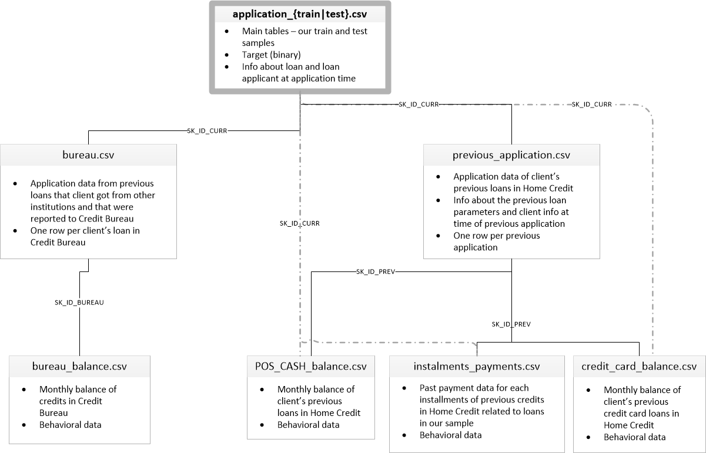
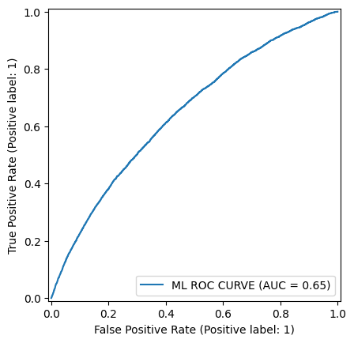
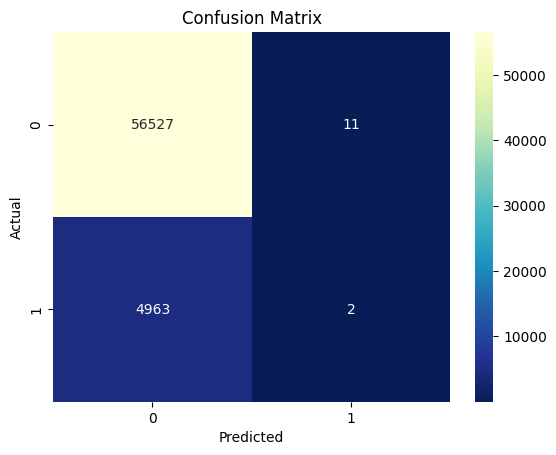

# ML_Model_Loan_Repayment_Prediction

`HomeCredit`사에 신청한 고객의 대출 상환 능력 예측 모델

## 0 계획

- 1 문제정의
- 2 모델 학습 1 - 기본 데이터셋 (application.csv)
- 3 모델 학습 2 - 추가 데이터셋 (application.csv + HomeCredit)
- 4 모델 학습 3 - 추가 데이터셋 (application.csv + Bureau)
- 5 모델 개선 및 평가

## 1 문제정의

### 데이터 소스

[Kaggle - Home Credit Default Risk](https://www.kaggle.com/competitions/home-credit-default-risk/overview)

### 1 HomeCredit 사의 대출 신청자 정보

| 파일 이름                         | 설명                                                                                                                                                         |
| --------------------------------- | ------------------------------------------------------------------------------------------------------------------------------------------------------------ |
| **application\_{train,test}.csv** | - 대출 신청자의 **인적 정보**와 **대출 정보**를 포함합니다.   - 대출 신청의 조건, 신청자의 개인적 사항, 요청된 대출 금액 등이 포함됩니다.                 |
| **previous_application.csv**      | - 대출 신청자가 **이전에 신청한 대출**에 대한 정보입니다.   - 이전 대출의 상태, 대출 금액, 이자율, 상환 기간 등이 포함됩니다.                             |
| **POS_CASH_BALANCE.csv**          | - 대출 신청자의 이전 **POS(소비자 대출)** 및 **현금 대출**에 대한 월별 상환 및 연체 정보입니다.   - 대출 금액, 연체 기간(DPD), 상환 상황 등이 포함됩니다. |
| **credit_card_balance.csv**       | - 대출 신청자의 **이전 신용카드 대출**에 대한 월별 잔액 스냅샷입니다.   - 신용 카드의 한도, 잔액, 연체, 상환 내역 등이 포함됩니다.                        |
| **installments_payments.csv**     | - **이전 대출 상환 내역**을 기록한 파일입니다.   - 각 대출에 대한 **상환 내역**과 **미납 내역**을 나타냅니다.                                             |

---

### 2 Bureau(신용정보기관)의 대출 신청자 과거 대출 정보

| 파일 이름              | 설명                                                                                                                                               |
| ---------------------- | -------------------------------------------------------------------------------------------------------------------------------------------------- |
| **bureau.csv**         | - 대출 신청자의 **기타 금융 기관의 대출 정보**를 포함합니다.   - 다른 신용 기관에서 받은 대출, 대출 금액, 상환 상태, 연체 정보 등을 제공합니다. |
| **bureau_balance.csv** | - **신용정보기관에 보고된 대출**에 대한 월별 상환 및 연체 정보입니다.   - 다른 금융 기관에서의 대출에 대한 월별 연체 및 상환 내역을 기록합니다. |

## 2 모델 학습 1 - 기본 데이터셋 (application.csv)
no sampling

| ROC_AUC             | Confusion Matrix                                                                                                                                               |
| ---------------------- | -------------------------------------------------------------------------------------------------------------------------------------------------- |
|         |  |
|

## 3 모델 학습 2 - 추가 데이터셋 (application.csv + HomeCredit)

T.B.D

## 4 모델 학습 3 - 추가 데이터셋 (application.csv + Bureau)

T.B.D

## 5 모델 개선 및 평가

T.B.D
